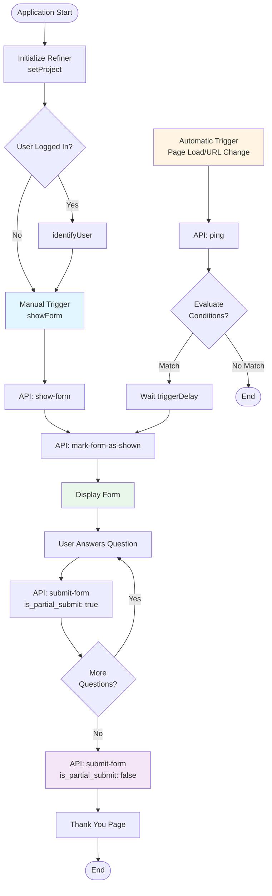
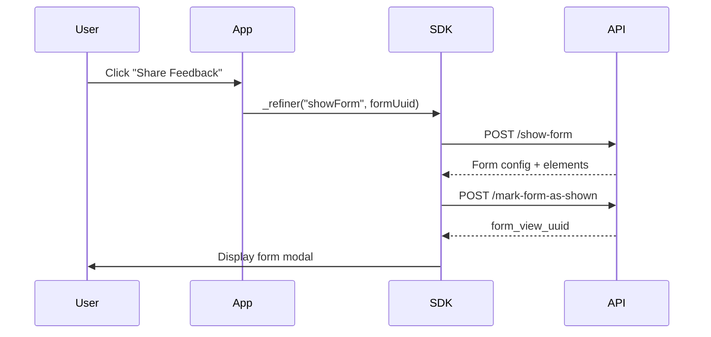
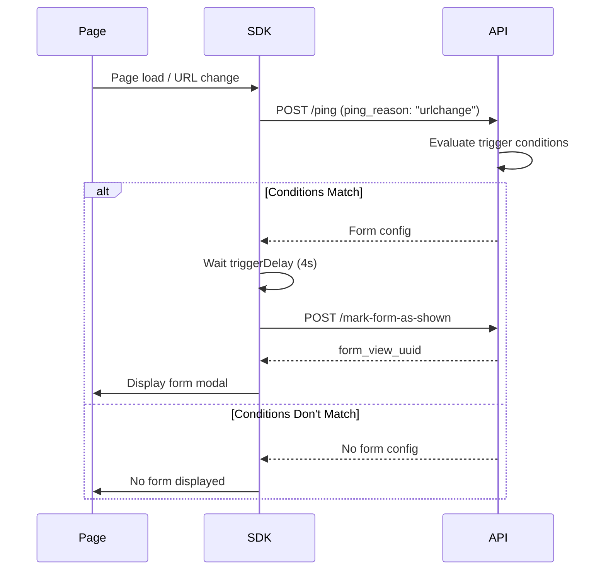
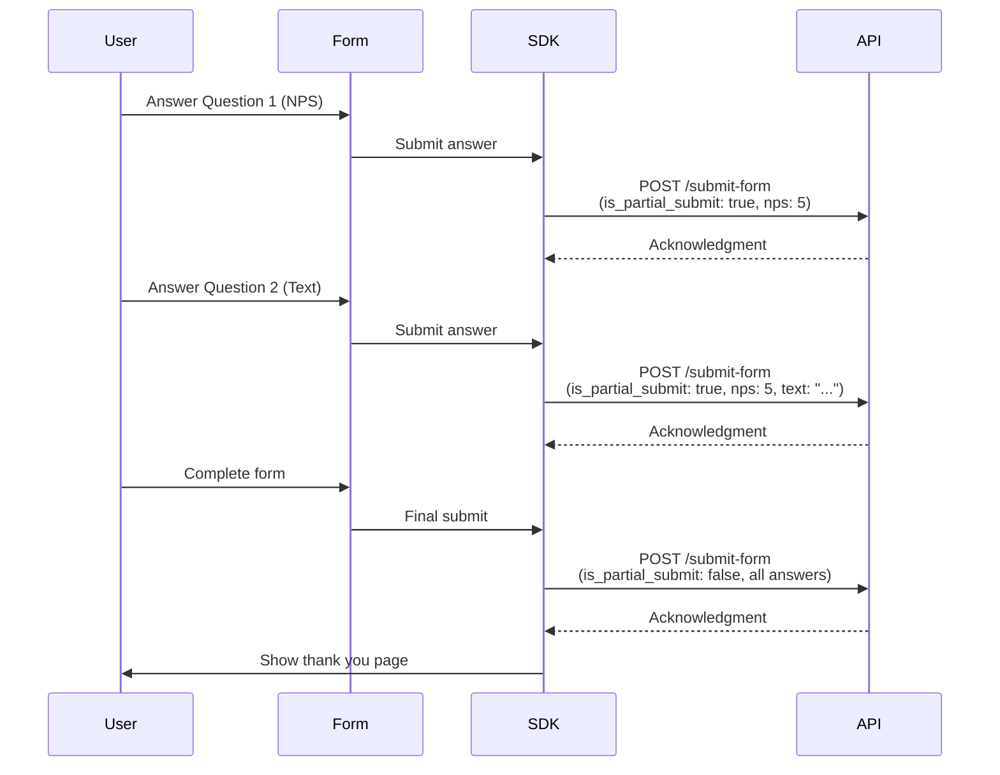

# Refiner Integration Documentation

Complete documentation of the Refiner form system integration, API flows, cookies, and data structures.

## Table of Contents

1. [Overview](#overview)
2. [Project Configuration](#project-configuration)
3. [Cookies and Session Management](#cookies-and-session-management)
4. [Manual Trigger Flow](#manual-trigger-flow)
5. [Automatic Trigger Flow](#automatic-trigger-flow)
6. [Form Submission Flow](#form-submission-flow)
7. [API Endpoints](#api-endpoints)
8. [Data Structures](#data-structures)
9. [Implementation Details](#implementation-details)

---

## Overview

Refiner is a user feedback and survey platform integrated into this application. It provides:

- **Manual form triggers**: Forms can be triggered programmatically via button clicks
- **Automatic form triggers**: Forms can automatically appear based on page visits, URL changes, and trigger rules
- **Progress saving**: Partial form submissions are saved automatically
- **Analytics tracking**: Complete view and submission tracking
- **Throttling**: Prevents showing forms too frequently to users

### Project UUID

```
88f6d7f0-8a16-11f0-bbfa-052e1a97567e
```

### Form UUID

```
e5de53c0-e000-11f0-bed2-43c154a2df6d
```

---

## Flow Diagrams

### Complete Flow Overview



### Manual Trigger Flow



### Automatic Trigger Flow



### Form Submission Flow



---

## Project Configuration

### Initialization

Refiner is initialized in `src/App.tsx`:

```typescript
// Set project UUID
_refiner("setProject", "88f6d7f0-8a16-11f0-bbfa-052e1a97567e");

// Identify user when logged in
_refiner("identifyUser", {
  id: userInfo.id || userInfo.username,
  email: userInfo.email,
  name: userInfo.username,
});
```

### Manual Form Trigger

Forms can be manually triggered from any component:

```typescript
import _refiner from "refiner-js";

_refiner("showForm", "e5de53c0-e000-11f0-bed2-43c154a2df6d");
```

**Location**: `src/pages/dashboard/workbench/index.tsx`

---

## Cookies and Session Management

Refiner uses several cookies to track users and manage sessions:

### Refiner-Specific Cookies

| Cookie Name | Purpose | Domain | Expiry |
|------------|---------|--------|--------|
| `XSRF-TOKEN` | CSRF protection token for secure API requests | `.refiner.io` | Session |
| `refiner_last_project_uuid` | Stores the last Refiner project UUID used | `.refiner.io` | ~4 months |
| `refiner_session` | Encrypted session data containing user identification, survey state, and session tracking | `.refiner.io` | Session |

### Cookie Details

#### XSRF-TOKEN
- **Purpose**: Cross-Site Request Forgery protection
- **Format**: Encrypted token
- **Usage**: Included in API requests for security

#### refiner_last_project_uuid
- **Value**: `88f6d7f0-8a16-11f0-bbfa-052e1a97567e`
- **Purpose**: Remembers which project was last used
- **Usage**: Helps SDK initialize with correct project

#### refiner_session
- **Format**: Encrypted JSON containing:
  - User identification data
  - Survey state and progress
  - Session tracking information
- **Purpose**: Maintains user identity and form state across page loads
- **Usage**: Critical for session continuity and progress saving

### Third-Party Cookies

| Cookie Name | Purpose | Service |
|------------|---------|---------|
| `_ga`, `_ga_VTSFFTBKQB` | Google Analytics visitor tracking | Google Analytics |
| `_gcl_au` | Google Analytics conversion linker | Google Analytics |
| `attr_landing` | Landing page attribution | Refiner Analytics |
| `wisepops*` | Popup/marketing tool data | WisePops |

---

## Manual Trigger Flow

### Flow Diagram

```
User clicks "Share Feedback" button
  ↓
_refiner("showForm", "e5de53c0-e000-11f0-bed2-43c154a2df6d")
  ↓
API: /v1/{project_uuid}/show-form
  ↓
Response: Form configuration and elements
  ↓
API: /v1/{project_uuid}/mark-form-as-shown
  ↓
Form displayed to user
  ↓
User answers questions (partial submissions)
  ↓
API: /v1/{project_uuid}/submit-form (is_partial_submit: true)
  ↓
User completes form
  ↓
API: /v1/{project_uuid}/submit-form (is_partial_submit: false)
```

### Step 1: Manual Form Trigger

**Code**:
```typescript
_refiner("showForm", "e5de53c0-e000-11f0-bed2-43c154a2df6d");
```

**Action**: SDK prepares to fetch and display the form.

### Step 2: Show Form API

**Endpoint**: `POST https://api.refiner.io/js-client/v1/{project_uuid}/show-form`

**Request Body**:
```json
{
  "is_embed": false,
  "is_hosted_page": false,
  "is_mobile": false,
  "is_debug_mode": null,
  "cookie_uuid": "a37ed8e2-d4fa-d33e-9bd2-4312f7aed365",
  "contact_remote_id": null,
  "contact_remote_id_signature": null,
  "contact_email": null,
  "account_remote_id": null,
  "form_uuid": "e5de53c0-e000-11f0-bed2-43c154a2df6d",
  "manual_form_view": true,
  "current_url": "http://localhost:3001/workbench",
  "uagent": "Mozilla/5.0 (Macintosh; Intel Mac OS X 10_15_7) AppleWebKit/537.36 (KHTML, like Gecko) Chrome/143.0.0.0 Safari/537.36",
  "locale": "en",
  "country": null
}
```

**Request Fields**:
- `cookie_uuid`: Unique visitor identifier from cookies
- `form_uuid`: The form to display
- `manual_form_view`: `true` indicates manual trigger (bypasses automatic rules)
- `current_url`: Current page URL
- `uagent`: User agent string
- `locale`: Language preference

**Response**:
```json
{
  "message": "ok",
  "component": "form-modal",
  "component_data": {
    "uuid": "e5de53c0-e000-11f0-bed2-43c154a2df6d",
    "config": { /* Form configuration */ },
    "elements": [ /* Form questions */ ],
    "send_partial_responses": true,
    "track_form_view": true,
    "logo_path": null,
    "popout_url": "https://survey.refiner.io/d1qnye-mq83o8?channel=popout&locale=en"
  },
  "styles": null,
  "on_page_delay": 0
}
```

### Step 3: Mark Form as Shown

**Endpoint**: `POST https://api.refiner.io/js-client/v1/{project_uuid}/mark-form-as-shown`

**Request Body**:
```json
{
  "is_embed": false,
  "is_hosted_page": false,
  "is_mobile": false,
  "is_debug_mode": null,
  "cookie_uuid": "a37ed8e2-d4fa-d33e-9bd2-4312f7aed365",
  "contact_remote_id": null,
  "contact_remote_id_signature": null,
  "contact_email": null,
  "contact_attributes": null,
  "account_remote_id": null,
  "write_operation": "append",
  "form_uuid": "e5de53c0-e000-11f0-bed2-43c154a2df6d",
  "form_view_uuid": null,
  "form_view_tags": null,
  "manual_form_view": true,
  "current_url": "http://localhost:3001/workbench",
  "uagent": "Mozilla/5.0 (Macintosh; Intel Mac OS X 10_15_7) AppleWebKit/537.36 (KHTML, like Gecko) Chrome/143.0.0.0 Safari/537.36",
  "locale": "en",
  "country": null
}
```

**Response**:
```json
{
  "message": "ok",
  "form_view_uuid": "98d5b1c0-e472-11f0-b5f1-530334c674e3",
  "ping_again_in": 10,
  "ping_on_next_page_visit": true
}
```

**Response Fields**:
- `form_view_uuid`: Unique identifier for this form view session
- `ping_again_in`: Seconds until next heartbeat ping
- `ping_on_next_page_visit`: Whether to track on next page navigation

**Purpose**: Records that the form was displayed and enables analytics tracking.

---

## Automatic Trigger Flow

### Flow Diagram

```
Page load / URL change
  ↓
API: /v1/{project_uuid}/ping (ping_reason: "urlchange")
  ↓
Response: Form configuration (if conditions met)
  ↓
Wait triggerDelay (4 seconds)
  ↓
API: /v1/{project_uuid}/mark-form-as-shown
  ↓
Form displayed to user
  ↓
[Same submission flow as manual trigger]
```

### Step 1: Ping API

**Endpoint**: `POST https://api.refiner.io/js-client/v1/{project_uuid}/ping`

**Request Body**:
```json
{
  "is_embed": false,
  "is_hosted_page": false,
  "is_mobile": false,
  "is_debug_mode": null,
  "cookie_uuid": "a37ed8e2-d4fa-d33e-9bd2-4312f7aed365",
  "contact_remote_id": null,
  "contact_remote_id_signature": null,
  "contact_email": null,
  "account_remote_id": null,
  "first_seen_at": 1766983007,
  "current_url": "http://localhost:3001/posts",
  "uagent": "Mozilla/5.0 (Macintosh; Intel Mac OS X 10_15_7) AppleWebKit/537.36 (KHTML, like Gecko) Chrome/143.0.0.0 Safari/537.36",
  "locale": "en",
  "country": null,
  "ping_reason": "urlchange"
}
```

**Request Fields**:
- `ping_reason`: Reason for ping (`"urlchange"`, `"pagevisit"`, `"heartbeat"`)
- `first_seen_at`: Unix timestamp of first visit
- `current_url`: Current page URL for trigger evaluation

**Response** (if form should be shown):
```json
{
  "message": "ok",
  "debug_info": null,
  "component": "form-modal",
  "component_data": {
    "uuid": "e5de53c0-e000-11f0-bed2-43c154a2df6d",
    "config": {
      "triggerEvent": "pagevisit",
      "triggerPages": [
        { "value": "/posts", "operator": "contains" },
        { "value": "localhost:3000/analysis", "operator": "contains" }
      ],
      "triggerDelay": 4,
      "triggerDelayUnit": "second",
      "triggerDelayReference": "first_seen",
      /* ... other config ... */
    },
    "elements": [ /* Form questions */ ]
  },
  "styles": null,
  "on_page_delay": 0
}
```

**Response** (if form should not be shown):
- Returns `null` or no `component_data`
- SDK does not display form

### Ping Evaluation Logic

The ping API evaluates multiple conditions:

#### 1. Page Matching
```json
"triggerPages": [
  { "value": "/posts", "operator": "contains" },
  { "value": "localhost:3000/analysis", "operator": "contains" }
]
```
- Checks if `current_url` matches any trigger page
- Operators: `contains`, `relative_contains`, `equals`, etc.

#### 2. Throttling Rules
```json
"throttleViews": 20000,
"throttleTimeFrame": 10080,
"throttleViewsPerContact": 20000
```
- Maximum views per contact within time frame
- Prevents showing form too frequently

#### 3. Scheduling
```json
"schedule": false,
"scheduleStart": null,
"scheduleEnd": null
```
- Time-based form availability
- Can restrict forms to specific date ranges

#### 4. Audience Targeting
```json
"targetAudience": "all",
"targetLocales": ["en"],
"targetWebDeviceTypes": ["desktop", "tablet", "mobile"],
"targetCountries": []
```
- Language matching
- Device type filtering
- Geographic targeting

#### 5. First Seen Tracking
```json
"triggerDelayReference": "first_seen",
"triggerDelay": 4,
"triggerDelayUnit": "second"
```
- Delay calculated from `first_seen_at` timestamp
- Ensures consistent delay timing

### Step 2: Trigger Delay

After ping returns form config:
- SDK waits `triggerDelay` seconds (4 seconds in example)
- Delay reference: `first_seen_at` timestamp
- Form appears after delay period

### Step 3: Mark Form as Shown

Same as manual trigger flow - records the form view.

---

## Form Submission Flow

### Partial Submissions

**When**: After each question is answered

**Endpoint**: `POST https://api.refiner.io/js-client/v1/{project_uuid}/submit-form`

**Request Body** (Example: NPS answer):
```json
{
  "is_embed": false,
  "is_hosted_page": false,
  "is_mobile": false,
  "is_debug_mode": null,
  "cookie_uuid": "a37ed8e2-d4fa-d33e-9bd2-4312f7aed365",
  "contact_remote_id": null,
  "contact_remote_id_signature": null,
  "contact_email": null,
  "contact_attributes": {
    "nps": 5
  },
  "account_remote_id": null,
  "account_attributes": {},
  "write_operation": "append",
  "form_uuid": "e5de53c0-e000-11f0-bed2-43c154a2df6d",
  "form_view_uuid": "98d5b1c0-e472-11f0-b5f1-530334c674e3",
  "form_view_tags": null,
  "is_partial_submit": true,
  "current_url": "http://localhost:3001/workbench",
  "uagent": "Mozilla/5.0 (Macintosh; Intel Mac OS X 10_15_7) AppleWebKit/537.36 (KHTML, like Gecko) Chrome/143.0.0.0 Safari/537.36",
  "locale": "en",
  "country": null
}
```

**Key Fields**:
- `is_partial_submit`: `true` for partial submissions
- `contact_attributes`: Current answers (incremental)
- `form_view_uuid`: Links to original form view

**Response**: Same structure as `mark-form-as-shown`

**Purpose**:
- Saves progress if user closes form
- Enables real-time analytics
- Allows resuming from last saved answer

### Final Submission

**When**: Form is completed (all questions answered)

**Endpoint**: `POST https://api.refiner.io/js-client/v1/{project_uuid}/submit-form`

**Request Body**:
```json
{
  "is_embed": false,
  "is_hosted_page": false,
  "is_mobile": false,
  "is_debug_mode": null,
  "cookie_uuid": "a37ed8e2-d4fa-d33e-9bd2-4312f7aed365",
  "contact_remote_id": null,
  "contact_remote_id_signature": null,
  "contact_email": null,
  "contact_attributes": {
    "nps": 0,
    "what_do_you_value_most_about_our_service": "Great UX"
  },
  "account_remote_id": null,
  "account_attributes": {},
  "write_operation": "append",
  "form_uuid": "e5de53c0-e000-11f0-bed2-43c154a2df6d",
  "form_view_uuid": "5d580f30-e474-11f0-b59f-cfd8b1044279",
  "form_view_tags": null,
  "is_partial_submit": false,
  "current_url": "http://localhost:3001/workbench",
  "uagent": "Mozilla/5.0 (Macintosh; Intel Mac OS X 10_15_7) AppleWebKit/537.36 (KHTML, like Gecko) Chrome/143.0.0.0 Safari/537.36",
  "locale": "en",
  "country": null
}
```

**Key Fields**:
- `is_partial_submit`: `false` indicates final submission
- `contact_attributes`: All final answers
- `form_view_uuid`: Links to form view session

**Response**: Same structure as `mark-form-as-shown`

**Purpose**:
- Marks form as complete
- Stores all final answers
- Triggers follow-up actions (if configured)
- Updates analytics

---

## API Endpoints

### Base URL

```
https://api.refiner.io/js-client/v1/{project_uuid}
```

### Endpoints

#### 1. Show Form
- **Method**: `POST`
- **Path**: `/show-form`
- **Purpose**: Fetch form configuration for manual display
- **Trigger**: Manual (`showForm()` call)

#### 2. Ping
- **Method**: `POST`
- **Path**: `/ping`
- **Purpose**: Evaluate if form should be shown automatically
- **Trigger**: Page load, URL change, heartbeat

#### 3. Mark Form as Shown
- **Method**: `POST`
- **Path**: `/mark-form-as-shown`
- **Purpose**: Record form view event
- **Trigger**: After form is displayed

#### 4. Submit Form
- **Method**: `POST`
- **Path**: `/submit-form`
- **Purpose**: Submit form answers (partial or final)
- **Trigger**: After each answer (partial) or form completion (final)

---

## Data Structures

### Form Configuration

```typescript
interface FormConfig {
  // Trigger Settings
  triggerEvent: "manually" | "pagevisit" | "scroll" | "time";
  triggerPages: Array<{
    value: string;
    operator: "contains" | "relative_contains" | "equals" | "startsWith";
  }>;
  triggerDelay: number;
  triggerDelayUnit: "second" | "minute" | "hour";
  triggerDelayReference: "first_seen" | "page_load";
  
  // Throttling
  throttle: boolean;
  throttleViews: number;
  throttleTimeFrame: number; // minutes
  throttleViewsPerContact: number;
  throttleResponses: number;
  throttleResponsesPerContact: number;
  
  // Scheduling
  schedule: boolean;
  scheduleStart: string | null;
  scheduleEnd: string | null;
  
  // Recurring
  recurring: "trigger" | "never" | "always";
  recurringInterval: string;
  recurringIntervalUnit: "day" | "week" | "month";
  recurringIntervalStop: number;
  recurringIntervalStopUnit: "day" | "week" | "month";
  
  // Targeting
  targetAudience: "all" | "segments";
  targetLocales: string[];
  targetCountries: string[];
  targetWebDeviceTypes: string[];
  targetMobilePlatforms: string[];
  targetSegmentUuids: string[];
  
  // Styling
  widgetLayout: "modal" | "sidebar" | "inline";
  widgetStyle: "round" | "square";
  widgetPrimaryColor: string;
  widgetBackgroundColor: string;
  widgetBorderColor: string;
  pagePrimaryColor: string;
  pageBackgroundColor: string;
  backdropColor: string;
  backdropOpacity: number;
  
  // Behavior
  backdropClose: boolean;
  hideCloseButton: boolean;
  progressBar: boolean;
  send_partial_responses: boolean;
  track_form_view: boolean;
  
  // Limits
  limitResponses: boolean;
  limitResponsesCount: number;
  limitResponsesPerContact: boolean;
  limitResponsesPerContactCount: number;
  limitResponsesPerContactText: string;
}
```

### Form Element

```typescript
interface FormElement {
  uuid: string;
  element_type: "nps" | "text" | "rating" | "choice" | "thank-you" | "email";
  name: string;
  slug: string;
  is_account_related: boolean;
  config: {
    question?: string;
    placeholder?: string;
    minLength?: number;
    isMandatory?: boolean;
    buttonTextContinue?: string;
    buttonTextBack?: string;
    buttonTextSkip?: string;
    buttonTextDismiss?: string;
    // Element-specific config
    [key: string]: any;
  };
}
```

### Contact Attributes

```typescript
interface ContactAttributes {
  // NPS Question
  nps?: number; // 0-10
  
  // Text Questions
  [questionSlug: string]: string | number | boolean;
}
```

### Form View Response

```typescript
interface FormViewResponse {
  message: "ok";
  form_view_uuid: string;
  ping_again_in: number; // seconds
  ping_on_next_page_visit: boolean;
}
```

---

## Implementation Details

### SDK Methods

#### setProject
```typescript
_refiner("setProject", "88f6d7f0-8a16-11f0-bbfa-052e1a97567e");
```
- Sets the Refiner project UUID
- Called once during app initialization
- Required before any other Refiner operations

#### identifyUser
```typescript
_refiner("identifyUser", {
  id: string;
  email?: string;
  name?: string;
});
```
- Identifies the current user
- Links form responses to user account
- Called when user logs in

#### showForm
```typescript
_refiner("showForm", "e5de53c0-e000-11f0-bed2-43c154a2df6d");
```
- Manually triggers a form display
- Bypasses automatic trigger rules
- Immediately fetches and displays form

### Form View UUID Lifecycle

1. **Form Display**: `mark-form-as-shown` returns `form_view_uuid`
2. **Partial Submissions**: Each partial submit uses the same `form_view_uuid`
3. **Final Submission**: Final submit may use a new `form_view_uuid` (if view was refreshed)
4. **Analytics**: All submissions linked to `form_view_uuid` for attribution

### Cookie UUID

- Generated on first visit
- Stored in `refiner_session` cookie
- Used to identify visitors across sessions
- Links all form views and submissions to same visitor

### Throttling Logic

Forms are throttled based on:
- **Views per contact**: Maximum views within time frame
- **Responses per contact**: Maximum responses per contact
- **Time frame**: Rolling window for throttling calculations

Example:
```json
"throttleViews": 20000,
"throttleTimeFrame": 10080, // minutes (7 days)
"throttleViewsPerContact": 20000
```
- Maximum 20,000 views per contact within 7 days
- Prevents form fatigue

### Progress Saving

- **Partial submissions**: Saved after each answer
- **Resume capability**: Users can continue where they left off
- **Data integrity**: Final submission overwrites partial data

### Heartbeat System

- `ping_again_in`: Seconds until next ping
- Used for engagement tracking
- Detects if user is still active
- Can trigger follow-up actions

---

## Example Form Structure

### Form Elements

1. **NPS Question**
   - Type: `nps`
   - Slug: `nps`
   - Question: "How likely are you to recommend our service to a friend or colleague?"
   - Score range: 0-10
   - Color coding: Promoters (green), Passives (yellow), Detractors (red)

2. **Text Question**
   - Type: `text`
   - Slug: `what_do_you_value_most_about_our_service`
   - Question: "What do you value most about our service?"
   - Min length: 8 characters
   - Optional field

3. **Thank You Page**
   - Type: `thank-you`
   - Headline: "Thanks for your response!"
   - Auto fade out: 6 seconds
   - Includes banner image

---

## Best Practices

### Manual Triggers

- Use for specific user actions (e.g., feedback button)
- Provide clear call-to-action
- Don't trigger too frequently

### Automatic Triggers

- Configure appropriate trigger pages
- Set reasonable delay times
- Use throttling to prevent form fatigue
- Test trigger conditions thoroughly

### User Experience

- Keep forms short and focused
- Use progress indicators
- Allow users to skip questions
- Provide clear thank-you messages

### Analytics

- Monitor form view rates
- Track completion rates
- Analyze drop-off points
- Use `form_view_uuid` for attribution

---

## Troubleshooting

### Form Not Appearing

1. Check project UUID is correct
2. Verify form UUID exists
3. Check trigger conditions (for automatic)
4. Verify throttling limits not exceeded
5. Check browser console for errors

### Partial Submissions Not Saving

1. Verify `send_partial_responses: true` in config
2. Check network requests for errors
3. Verify `form_view_uuid` is consistent

### User Not Identified

1. Ensure `identifyUser` is called after login
2. Check user info is available
3. Verify user is not "guest"

---

## References

- [Refiner Documentation](https://refiner.io/docs)
- [Refiner JS SDK](https://github.com/refiner-io/refiner-js)
- Project UUID: `88f6d7f0-8a16-11f0-bbfa-052e1a97567e`
- Form UUID: `e5de53c0-e000-11f0-bed2-43c154a2df6d`

---

## Changelog

- **2025-12-29**: Initial documentation created
- Documented manual and automatic trigger flows
- Documented form submission flow
- Documented API endpoints and data structures

